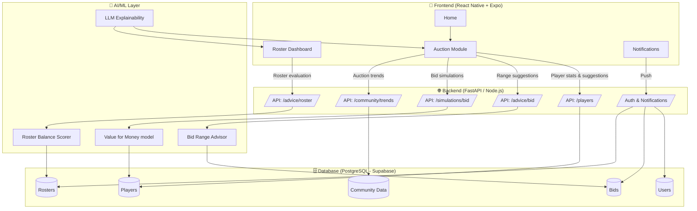

# Fantasy Assistant ⚽📊

[](LICENSE)


**Fantasy Assistant** is a comprehensive, AI-powered fantasy football (Serie A) assistant that helps managers optimize their auction strategy, manage rosters, and make data-driven decisions throughout the season.

## 🎯 Key Features

### 🎪 Smart Auction Management
- **Multiple Auction Types**: Classic, Snake Draft, Sealed-Bid, Hybrid
- **AI-Powered Bid Recommendations**: Get optimal bid ranges based on player value, market trends, and your budget
- **Real-time Budget Tracking**: Never overspend with dynamic budget monitoring
- **Bid Simulations**: Preview outcomes before placing bids

### 📊 Intelligent Roster Analysis
- **Balance Score**: Comprehensive evaluation of roster composition
- **Strength/Weakness Analysis**: AI identifies gaps and opportunities
- **Quality & Depth Metrics**: Multi-dimensional roster evaluation
- **Trade Suggestions**: Data-driven trade recommendations

### 👥 Community Intelligence
- **Market Trends**: See what other managers are doing
- **Player Popularity**: Track most sought-after players
- **Price Analytics**: Historical auction price data

### 🤖 Machine Learning Integration
- Player valuation models
- Roster optimization algorithms
- Predictive analytics for player performance

---

## 🚀 Quick Start

### Using Docker (Recommended)

```bash
# Clone repository
git clone <repository-url>
cd fantasy-assistant

# Start all services
cd backend
docker-compose up -d

# Initialize database with sample data
docker-compose exec backend python scripts/init_db.py

# Backend API: http://localhost:8000
# API Docs: http://localhost:8000/docs
```

### Frontend Setup

```bash
cd frontend
npm install
npm start

# Press 'a' for Android, 'i' for iOS, 'w' for web
```

📖 **For detailed setup instructions, see [SETUP.md](SETUP.md)**

---

## 🏗️ Architecture

### Tech Stack

**Backend:**
- FastAPI (Python)
- PostgreSQL (via Supabase)
- Redis (caching)
- SQLAlchemy (ORM)
- Scikit-learn (ML)

**Frontend:**
- React Native + Expo
- TypeScript
- React Navigation
- React Query (data fetching)
- React Native Paper (UI)

**DevOps:**
- Docker & Docker Compose
- Alembic (migrations)
- GitHub Actions (CI/CD)

### System Architecture

```
┌─────────────────────────────────────────────────────────────┐
│                     Mobile App (Expo)                       │
│  ┌──────────┐  ┌──────────┐  ┌──────────┐  ┌──────────┐  │
│  │  Auth    │  │ Players  │  │ Auctions │  │ Rosters  │  │
│  └──────────┘  └──────────┘  └──────────┘  └──────────┘  │
└───────────────────────┬─────────────────────────────────────┘
                        │ REST API
┌───────────────────────▼─────────────────────────────────────┐
│                   FastAPI Backend                           │
│  ┌────────────┐  ┌────────────┐  ┌──────────────────────┐ │
│  │   Auth     │  │  Players   │  │  Auctions/Rosters    │ │
│  │  Service   │  │  Service   │  │      Service         │ │
│  └────────────┘  └────────────┘  └──────────────────────┘ │
│                                                             │
│  ┌─────────────────────────────────────────────────────┐  │
│  │              ML/AI Layer                            │  │
│  │  • Player Valuation    • Roster Analysis           │  │
│  │  • Bid Recommendations • Trade Suggestions         │  │
│  └─────────────────────────────────────────────────────┘  │
└───────────────────┬──────────────────────┬──────────────────┘
                    │                      │
         ┌──────────▼────────┐  ┌─────────▼────────┐
         │   PostgreSQL      │  │      Redis       │
         │   (Supabase)      │  │    (Caching)     │
         └───────────────────┘  └──────────────────┘
```

---

## 📱 Features Implemented

### ✅ Phase 1: Core Infrastructure
- [x] FastAPI backend with full REST API
- [x] React Native mobile app
- [x] PostgreSQL database with complete schema
- [x] JWT authentication system
- [x] Docker setup for easy deployment

### ✅ Phase 2: Player Management
- [x] Player database with Serie A players
- [x] Player search and filtering
- [x] Detailed player statistics
- [x] Sample data importer

### ✅ Phase 3: Auction System
- [x] Create and manage auctions
- [x] Multiple auction types support
- [x] Place bids (open and sealed)
- [x] Real-time bid tracking
- [x] AI bid recommendations

### ✅ Phase 4: Roster Management
- [x] Create and manage rosters
- [x] Import players from auctions
- [x] Roster analysis with balance scoring
- [x] Strength/weakness identification
- [x] Improvement suggestions

### ✅ Phase 5: ML & Analytics
- [x] Player valuation algorithm
- [x] Roster balance analyzer
- [x] Bid recommendation engine
- [x] Community trends tracking

---

## 🔮 Roadmap

### Phase 6: Advanced Features (Next)
- [ ] Weekly lineup recommendations
- [ ] Player injury tracking
- [ ] Match difficulty analysis
- [ ] Push notifications
- [ ] Trade marketplace

### Phase 7: ML Enhancements
- [ ] Train models on historical data
- [ ] Performance prediction models
- [ ] Advanced optimization algorithms
- [ ] LLM integration for explanations

### Phase 8: Social Features
- [ ] League management
- [ ] Public roster comparison
- [ ] Chat and messaging
- [ ] Leaderboards

---

## 📚 Documentation

- **[SETUP.md](SETUP.md)** - Detailed setup and installation guide
- **[DEVELOPMENT.md](DEVELOPMENT.md)** - Development guide and best practices
- **API Docs** - Available at `http://localhost:8000/docs` when running

---

## 🎯 Use Cases

### During Auction
1. Browse available players with real-time stats
2. Get AI-powered bid recommendations
3. Track your budget dynamically
4. Simulate bid outcomes
5. Compare with community trends

### Post-Auction
1. Import your roster from auction
2. Get comprehensive roster analysis
3. Identify strengths and weaknesses
4. Receive improvement suggestions
5. Explore trade opportunities

### Season Management
1. Get weekly lineup recommendations
2. Track player injuries and suspensions
3. Monitor player form and performance
4. Adjust strategy based on fixtures

---

## 🤝 Contributing

Contributions are welcome! Please feel free to submit a Pull Request.

1. Fork the repository
2. Create your feature branch (`git checkout -b feature/AmazingFeature`)
3. Commit your changes (`git commit -m 'Add some AmazingFeature'`)
4. Push to the branch (`git push origin feature/AmazingFeature`)
5. Open a Pull Request

---

## 📄 License

This project is licensed under the MIT License - see the [LICENSE](LICENSE) file for details.

---

## 🙏 Acknowledgments

- Serie A for player data
- Fantacalcio community
- All contributors and testers

---

## 📧 Contact

For questions or suggestions, please open an issue on GitHub.

---

## 🏗️ Original Architecture Diagram



---

**Built with ❤️ for fantasy football managers**
