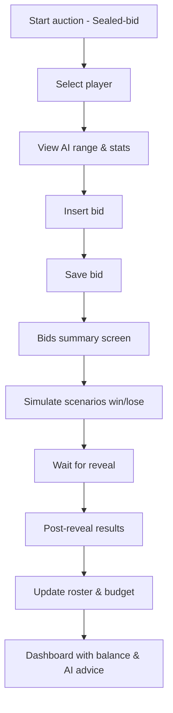
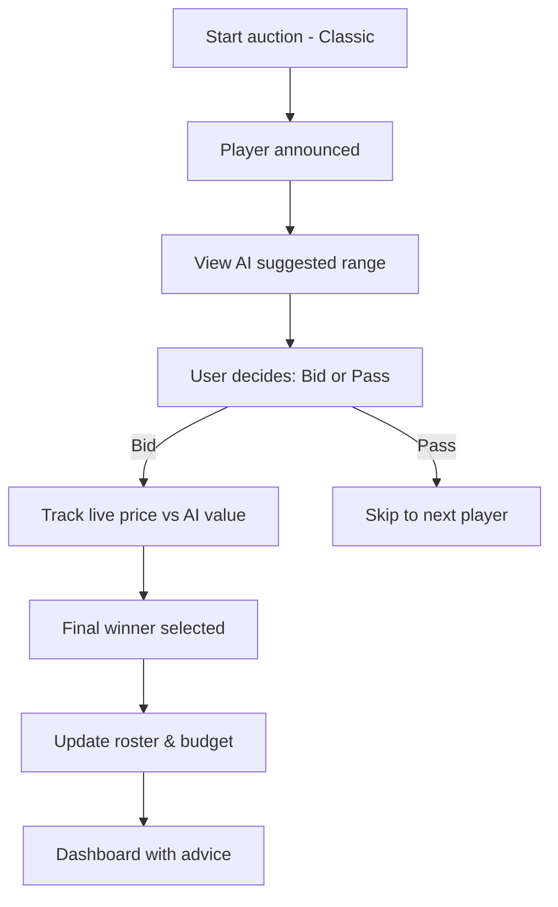
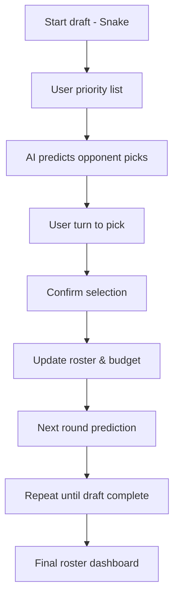
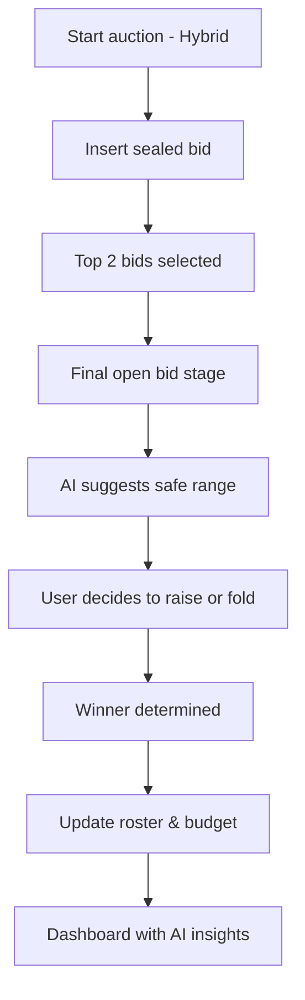
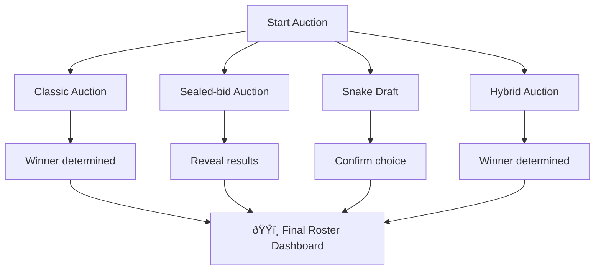
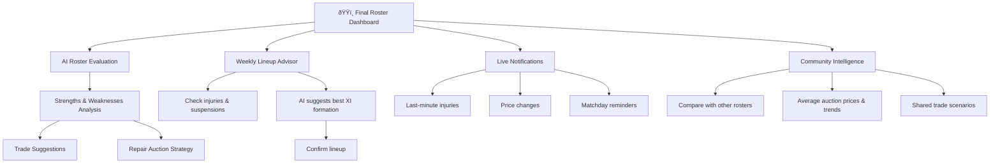

# Fantasy Assistant ⚽📊  

  
  
  
  

**Fantasy Assistant** is a data-driven fantasy football (Serie A) assistant.  
It helps managers during **auctions** (including sealed-bid), **roster management**, **trades**, and **weekly lineups** using stats, historical data, community insights, and AI-powered predictions.  

---

## ✨ Features

### Auctions
- Support for different auction types:
  - **Classic** (open bids)
  - **Snake draft**
  - **Hybrid** (sealed-bid + open)
  - **Sealed-bid** (special focus)
- Suggested bid ranges based on player value, market trends, and historical data.
- Simulations of possible outcomes (if you win/lose a player).
- Dynamic budget advisor to optimize strategy.

### Post-Auction Roster
- Dashboard with role balance score.
- Strengths and weaknesses analysis.
- Trade suggestions and repair auction strategy.

### Season Management
- Weekly lineup recommendations based on stats, fixtures, and injuries.
- Notifications about unavailable players and price changes.
- Comparison with public rosters and community intelligence.

---

## 🏗️ Architecture (MVP)

```mermaid
flowchart TD

    subgraph Client["📱 Frontend (React Native + Expo)"]
        A1[Home]
        A2[Auction Module]
        A3[Roster Dashboard]
        A4[Notifications]
    end

    subgraph Backend["🌐 Backend (FastAPI / Node.js)"]
        B1[/API: /players/]
        B2[/API: /advice/bid/]
        B3[/API: /simulations/bid/]
        B4[/API: /advice/roster/]
        B5[/API: /community/trends/]
        B6[/Auth & Notifications/]
    end

    subgraph DB["🗄️ Database (PostgreSQL - Supabase)"]
        D1[(Players)]
        D2[(Users)]
        D3[(Bids)]
        D4[(Rosters)]
        D5[(Community Data)]
    end

    subgraph AI["🤖 AI/ML Layer"]
        M1[Value for Money model]
        M2[Bid Range Advisor]
        M3[Roster Balance Scorer]
        M4[LLM Explainability]
    end

    %% Connections
    A1 --> A2
    A2 -->|Player stats & suggestions| B1
    A2 -->|Range suggestions| B2
    A2 -->|Bid simulations| B3
    A3 -->|Roster evaluation| B4
    A2 -->|Auction trends| B5
    A4 -->|Push| B6

    B1 --> D1
    B2 --> M2
    B3 --> M1
    B4 --> M3
    B5 --> D5
    B6 --> D2
    B6 --> D3
    B6 --> D4

    M2 --> D3
    M3 --> D4
    M1 --> D1
    M4 --> A2
    M4 --> A3
```

---

## 🔄 User Flows

### 🎯 Sealed-bid Auction

### 📢 Classic Auction

### 🐍 Snake Draft

### 🔀 Hybrid Auction

---

### 🔄 Comparative User Flow

---

## 📊 User Flow – Post-Auction Dashboard

---

## 🚀 Roadmap
- [ ] MVP: Auction Assistant (bid ranges, sealed-bid simulator, budget advisor)  
- [ ] Post-auction dashboard with role balance and insights  
- [ ] Weekly lineup recommender  
- [ ] Trade module with roster comparisons  
- [ ] Community intelligence (share and learn from real auctions)  

---

## 📖 License
TBD – choose a license depending on distribution model.  

---

## 🙌 Contributing
Contributions are welcome!  
Feel free to open issues and pull requests.  

---

## 🏟️ Goal
To build the **first complete assistant for fantasy football managers**, combining **data, AI, and practical insights** into one app.  